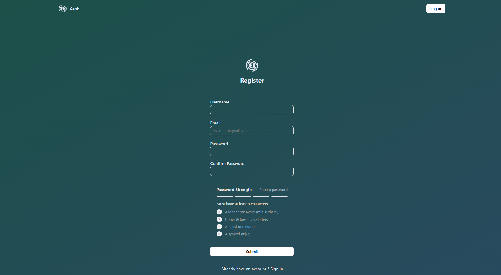
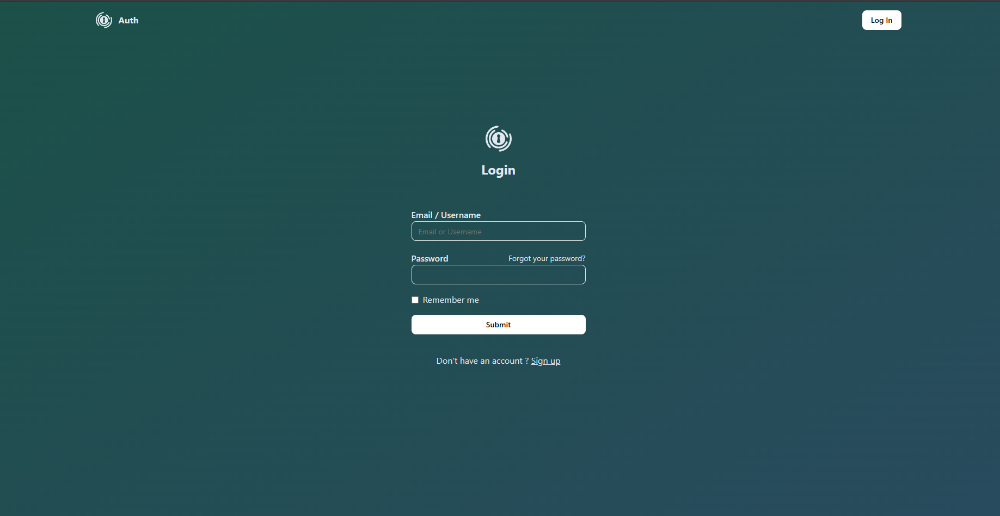
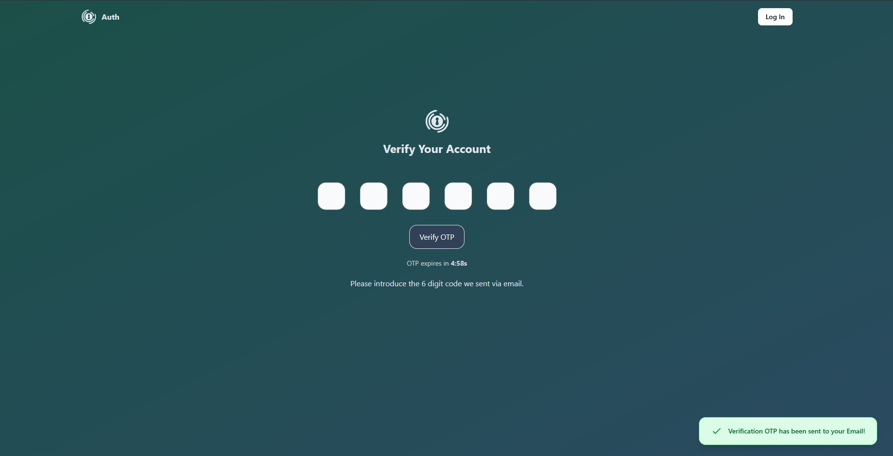
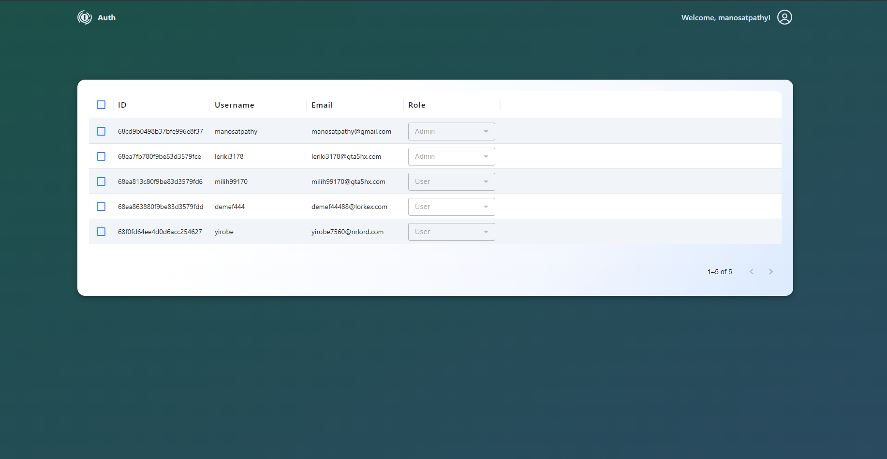
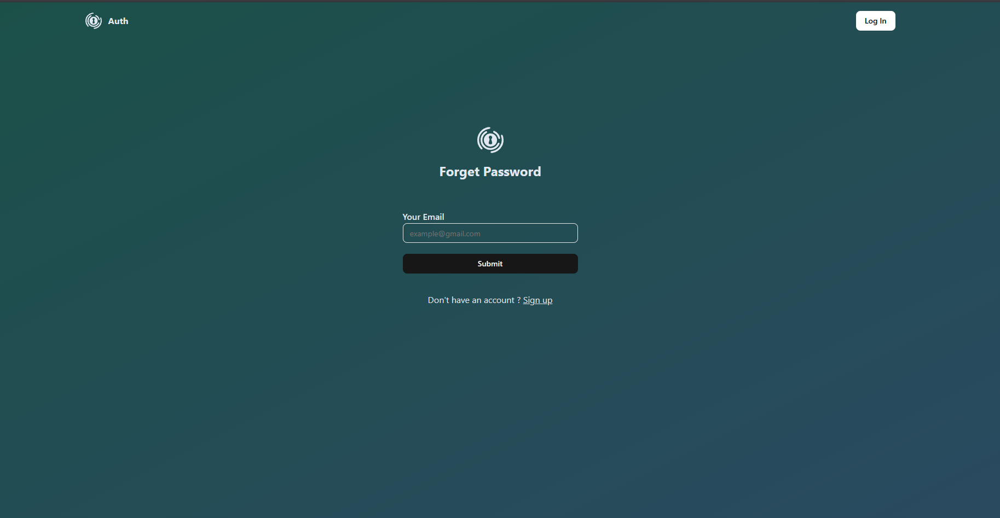

# 🔐 Authentication System

> Production-ready authentication system with JWT refresh tokens, Redis session management, role-based access control, 2FA via OTP, and enterprise-level security features.

## ✨ Features

- **User Authentication** - Secure registration, login, and logout with JWT tokens
- **Token Management** - Automatic token refresh with intelligent request queuing using Axios interceptors
- **Redis Session Management** - Distributed caching, rate limiting, and real-time session invalidation with single-session enforcement
- **Two-Factor Authentication (2FA)** - OTP-based verification for enhanced security
- **Role-Based Access Control (RBAC)** - Admin dashboard for user management and role assignment
- **Security Features** - CSRF protection, bcrypt password encryption, input validation and sanitization
- **Email Verification** - Email confirmation with secure token-based verification
- **Password Reset** - Secure password recovery via email with time-limited tokens
- **Full-Stack Type Safety** - Zod validation schemas shared across client and server

## 🛠️ Tech Stack

**Frontend:**
- TypeScript
- React.js
- React Hook Form
- TanStack Query (React Query)
- Zod (Validation)
- Axios (with interceptors)

**Backend:**
- TypeScript
- Node.js
- Express.js
- MongoDB with Mongoose
- Redis (Session management, caching, rate limiting)
- JWT (Access + Refresh Tokens)
- bcrypt (Password hashing)
- Nodemailer (Email service)

## 📋 Installation

**1. Clone the repository**
```bash
git clone https://github.com/manosatpathy/full-authentication.git
cd full-authentication
```

**2. Install dependencies**
```bash
# Install backend dependencies
cd server
npm install

# Install frontend dependencies
cd ../client
npm install
```


**3. Create `.env` file in backend directory**
```env
# Server
FRONTEND_URL=http://localhost:5173
PORT=8080
NODE_ENV=development

MONGODB_CONNECTION_STRING=your-mongodb-connection-string
ACCESS_TOKEN_SECRET=your-access-token-secret
REFRESH_TOKEN_SECRET=your-refresh-token-secret

SMTP_USER=your-smtp-user
SMTP_PASS=your-smtp-password
EMAIL_USER=your-email@example.com

REDIS_URL=your-redis-url
```

**4. Create `.env` file in frontend directory**
```env
VITE_API_BASE_URL=http://localhost:8080/api
```

**6. Run the application**
```bash
# Terminal 1 - Backend
cd server
npm run dev

# Terminal 2 - Frontend
cd client
npm run dev
```

- Backend runs on `http://localhost:8080`
- Frontend runs on `http://localhost:5173`

## 🔌 API Endpoints

### Authentication
| Method | Endpoint | Description | Auth Required |
|--------|----------|-------------|---------------|
| POST | `/api/auth/register` | Register new user | No |
| POST | `/api/auth/verify/:token` | verify new user | No |
| POST | `/api/auth/login` | Login user | No |
| POST | `/api/auth//verify` | Verify to login | No |
| POST | `/api/auth/logout` | Logout user | Yes |
| POST | `/api/auth/refresh-token` | Refresh Token | Yes |
| POST | `/api/auth/resend-verification` | Resend verfication otp | No |
| POST | `/api/auth/refresh-csrf` | Refresh Csrf Token | Yes |

### Users
| Method | Endpoint | Description | Auth Required |
|--------|----------|-------------|---------------|
| GET | `/api/users/me` | Get Current User | Yes |
| GET | `/api/users/check-username` | Check Username Availability | Yes |
| PATCH | `/api/users/username` | Update Username | Yes |

### Admin Dashboard
| Method | Endpoint | Description | Auth Required |
|--------|----------|-------------|---------------|
| GET | `/api/admin/users` | Get all users | Admin |
| PATCH | `/api/admin/users/:userId/role` | Update user role | Admin |

### Password
| Method | Endpoint | Description | Auth Required |
|--------|----------|-------------|---------------|
| POST | `/api/password/forget` | Send Reset Token | No |
| POST | `/api/password/reset/:token` | Reset Password | No |
| PATCH | `/api/password/update` | Update Password | Yes |

## 📝 API Usage Examples

### Register User
```bash
POST /api/auth/register
Content-Type: application/json

{
 "username": "manosatpathy16122222",
 "email": "satpathym16122222@gmail.com",
 "password": "Pass345word@1403",
 "confirmPassword": "Pass345word@1403"
}
```

**Response:**
```json
{
 "error": false,
 "message": "A verification link has been sent to your Email. It will expire in 5 minutes."
}
```

### Login
```bash
POST /api/auth/login
Content-Type: application/json

{
 "identifier": "manosatpathy16122222",
 "password": "Pass345word@1403"
}
```

**Response:**
```json
{
    "error": false,
    "message": "Verification OTP has been sent. It will be valid for 5 min",
    "otpExpiry": "2025-10-23T15:20:25.663Z"
}
```

### Verify Otp
```bash
POST /api/auth/verify
Content-Type: application/json

{
  "otp": "635059"
}
```

**Response:**
```json
{
    "message": "Welcome manosatpathy",
    "user": {
        "_id": "68cd9b0498b37bfe996e8f37",
        "username": "manosatpathy",
        "email": "manosatpathy@gmail.com",
        "role": "admin"
    },
    "sessionInfo": {
        "sessionId": "159b0f479bfb2abb6133ec532aab827991055318ad1b309e66ab2aafa410915f",
        "loginTime": "2025-10-23T15:16:52.575Z",
        "csrfToken": "982c2e2536494d4884a262545eaea4c0622faf4ad95d3f7e15b11747d4ab8574"
    }
}
```

### Get Current User (Protected Route)
```bash
GET /api/users/me
Authorization:  YOUR_ACCESS_TOKEN
```

**Response:**
```json
{
    "message": "User fetched success",
    "user": {
        "id": "68cd9b0498b37bfe996e8f37",
        "email": "manosatpathy@gmail.com",
        "username": "manosatpathy",
        "role": "admin"
    },
    "sessionInfo": {
        "sessionId": "159b0f479bfb2abb6133ec532aab827991055318ad1b309e66ab2aafa410915f",
        "loginTime": "2025-10-23T15:16:52.386Z",
        "lastActivity": "2025-10-23T15:22:51.486Z"
    }
}
```

## 🔒 Key Security Features

### 1. **Redis Session Management**
- Real-time session invalidation across all devices
- Single-session enforcement (optional)
- Distributed caching reduces database queries by 70%
- Rate limiting to prevent brute force attacks

### 2. **Token Strategy**
- Short-lived access tokens (15 minutes)
- Long-lived refresh tokens (7 days) stored in HTTP-only cookies
- Automatic token refresh with Axios interceptors
- Intelligent request queuing during token refresh

### 3. **Password Security**
- bcrypt hashing with salt rounds
- Password strength validation with Zod
- Account lockout after failed login attempts

### 4. **CSRF Protection**
- Token-based CSRF prevention
- Secure cookie configuration
- SameSite cookie attributes

### 5. **Type Safety & Validation**
- Zod schemas shared between frontend and backend
- React Hook Form integration for client-side validation
- Server-side validation and sanitization at every layer

## 🏗️ Architecture Highlights

### Frontend
- **Automatic Token Refresh**: Axios interceptors handle token expiration seamlessly
- **Request Queuing**: Multiple failed requests queued and retried after token refresh
- **Form Validation**: React Hook Form + Zod for type-safe form handling
- **State Management**: TanStack Query for server state caching and synchronization

### Backend
- **Redis Caching**: Session data, rate limiting, and temporary tokens cached in Redis
- **Role-Based Middleware**: Protect routes based on user roles
- **Email Queue**: Async email sending with retry logic
- **Error Handling**: Centralized error handling with detailed logging

## 📸 Screenshots

### Registration


### Login


### Two-Factor Authentication


### Admin Dashboard


### Email Verification


### Password Reset


## 👤 Contact

**Manoranjan Satpathy**
- LinkedIn: [linkedin.com/in/mano](https://www.linkedin.com/in/manosatpathy)
- Email: manosatpathy@gmail.com

---

Made with ❤️ by Manoranjan Satpathy
